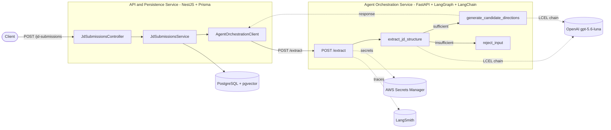

# JobPilot

**An AI-powered live-coding training content generator** — paste a job description in,
get back a structured extraction and a set of candidate technical training directions,
each with a rationale traceable back to the original text. Built as a two-service system
to explore a real microservice boundary between an API/persistence layer and an
LLM-orchestration layer, rather than bolting AI calls onto a monolith.

[](https://www.typescriptlang.org/)
[](https://nestjs.com/)
[](https://www.prisma.io/)
[](https://www.python.org/)
[](https://fastapi.tiangolo.com/)
[](https://www.langchain.com/langgraph)
[](https://www.langchain.com/)
[](https://github.com/pgvector/pgvector)
[](https://aws.amazon.com/secrets-manager/)

---

## What it does

A recruiter or hiring engineer pastes a raw, unstructured job description into the
system. The pipeline:

1. Extracts structured signal from the text — **role**, **tech stack**, **seniority**
   (inferred when not stated explicitly)
2. Judges whether the JD actually contains enough information to work with, and if not,
   rejects it with a reason instead of hallucinating a guess
3. Recommends **0–6 candidate technical training directions**, each with a rationale
   that quotes or clearly references the original JD text (no fabricated justification
   allowed), tags, and a suggested interview-question count
4. Persists the submission and its directions for later use in downstream question
   generation

## Architecture

Two independently deployable services, connected only by a documented HTTP contract —
no shared database connection, no in-process call, no filesystem coupling.



| Service | Stack | Responsibility |
|---|---|---|
| **API & Persistence** | Node.js · TypeScript · NestJS · Prisma · Zod | Public API surface, request validation, persistence (Postgres + pgvector), calling the agent service |
| **Agent Orchestration** | Python · FastAPI · LangGraph · LangChain · Pydantic | LLM-driven extraction and reasoning, structured-output enforcement, state-graph orchestration |

## How this was built and verified

**Architecture ownership.** Structural changes — database schema, orchestration
topology, the service-to-service contract — are designed and decided before
implementation, recorded in a versioned governance document with semantic-versioned
amendments and a stated rationale for every change, not decided ad hoc as code is
written. Concrete trade-offs were weighed and recorded at decision time, including
cases where the simpler option (a bare Postgres driver, a different test runner) was
deliberately passed over for a stated reason rather than defaulted into.

**Verification discipline.** No feature is considered done until typecheck, lint, and
the full test suite pass — and test coverage is checked by a reviewer independent of
whoever wrote the implementation, not self-graded. That review isn't a rubber stamp:
one round deliberately reverted a proposed fix and re-ran the previously-failing test
to confirm the fix — not a coincidence — was what made it pass. The same process
separately caught an import-time side effect that silently fetched cloud credentials
on module load, invisible in a normal test run, before it ever reached a shared branch.

**Security posture.** Zero long-lived credentials are ever committed to this repo.
Provider API keys are resolved at runtime from AWS Secrets Manager under a
least-privilege IAM policy scoped to a single secret ARN — not a `.env` file and hope.

**Manual verification beyond automated tests.** The full request path — client through
both services, out to the LLM provider, back into Postgres — was manually run and
verified end-to-end and documented per feature, not just asserted via mocked unit
tests.

**Process calibration.** The heavier design-review flow (full spec → plan → tasks →
implement, with a Constitution Check gate) is applied selectively — only to structural
changes with real blast radius (schema, service boundaries, orchestration topology).
Everyday changes use a lightweight plan-and-implement path instead. Deciding *when*
process overhead is worth its cost is itself part of the design, not a fixed ritual
applied uniformly everywhere.

## Getting started

**Prerequisites**: Node.js ≥ 20, Python ≥ 3.12, [`uv`](https://docs.astral.sh/uv/),
Docker, an AWS account with a Secrets Manager secret configured (see
`agent-service/.env.example`).

```bash
# 1. Postgres + pgvector
docker run -d --name jobpilot-postgres -p 5432:5432 \
  -e POSTGRES_USER=jobpilot -e POSTGRES_PASSWORD=jobpilot -e POSTGRES_DB=jobpilot \
  pgvector/pgvector:pg16

# 2. API & persistence service
npm install
npm run dev            # http://localhost:3000

# 3. Agent orchestration service
cd agent-service
uv sync
uv run uvicorn agent_service.main:app --reload   # http://localhost:8000
```

```bash
curl -X POST http://localhost:3000/jd-submissions \
  -H "Content-Type: application/json" \
  -d '{"text": "Senior Backend Engineer, 5+ years, Node.js, PostgreSQL, AWS."}'
```

## Testing & quality gates

| | Command |
|---|---|
| API service tests | `npm run test` |
| API service typecheck | `npm run typecheck` |
| API service lint | `npm run lint` |
| Agent service tests | `cd agent-service && uv run pytest` |
| Agent service typecheck | `cd agent-service && uv run mypy src` |
| Agent service lint | `cd agent-service && uv run ruff check .` |

Every feature ships with tests before it's considered done — LLM calls are always
mocked at the node level, real end-to-end verification (with a live OpenAI key) is a
separate, explicit manual step documented per-feature in `specs/*/quickstart.md`.

## Project status

- [x] JD structured extraction + candidate training direction recommendation (MVP)
- [x] NestJS + Prisma persistence layer with pgvector enabled
- [x] Python agent-orchestration service (FastAPI + LangGraph + LangChain)
- [x] Full pipeline verified end-to-end: client → NestJS → Python → OpenAI → Postgres
- [x] AWS Secrets Manager credential management, least-privilege IAM
- [ ] Interview question generation from a chosen training direction
- [ ] Judge0-sandboxed code execution for generated questions
- [ ] AWS data pipeline (S3 + EventBridge + Lambda + Step Functions + DynamoDB)
- [ ] Frontend

## Development process

This project follows a lightweight Spec-Driven Development workflow governed by
[`.specify/memory/constitution.md`](.specify/memory/constitution.md). Structural changes
(schema, LangGraph topology, service-boundary contracts) go through full
spec → plan → tasks → implement artifacts under [`specs/`](specs/); everything else uses
a short plan and goes straight to implementation. Each feature maps to exactly one
tracked issue and one PR, synced at start and completion — the `SCRUM-XX` references
inside `specs/` are that tracker's issue keys, not internal noise.
