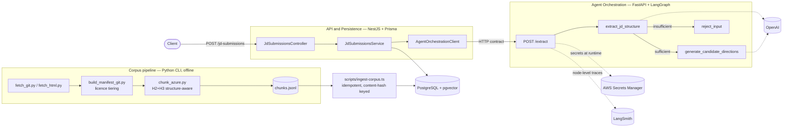

# JobPilot

**Turn a job description into a practicable interview syllabus — where every claim traces
back, word for word, to authoritative documentation.**

Not "what is CQRS?" but "read latency is 800ms, writes are cheap, reads outnumber writes
200:1, someone proposes CQRS — what three questions do you ask, and when would you say
no?" Then, for every benefit, cost and applicability condition in the answer key, a
verbatim excerpt from the source that supports it.

[](https://www.typescriptlang.org/)
[](https://nestjs.com/)
[](https://www.prisma.io/)
[](https://www.python.org/)
[](https://fastapi.tiangolo.com/)
[](https://www.langchain.com/langgraph)
[](https://github.com/pgvector/pgvector)
[](https://aws.amazon.com/secrets-manager/)

---

## The idea

Most retrieval-augmented systems stop once the retrieved text is in the prompt. The
interesting failure happens right after that: a model can cite a passage that genuinely
exists and still be wrong about what it supports.

That is not hypothetical here. In an early hand-run experiment, a generated answer key
attached this quotation to a *drawback* of one architectural option:

> "Supports multiple denormalized views that are scalable and performant"

The sentence is real, and a substring check passes. It is also describing a *benefit* of a
different option. The model didn't fabricate the source — it fabricated the *support
relation*.

So the design treats grounding as its own pipeline stage rather than a side effect of
retrieval: a mechanical check that the quoted text really is in the cited chunk, and a
second, deliberately isolated judgment — given only the claim and the quotation, nothing
about how either was produced — on whether the quotation actually supports the claim.

The full reasoning, including what was measured and what was abandoned, lives in
[`docs/DESIGN.md`](docs/DESIGN.md).

---

## Why this stack, and why it's split this way

Three runtimes, three genuinely different jobs, with the boundaries drawn on purpose.

| Component | Stack | Job |
|---|---|---|
| **API & persistence** | Node.js · TypeScript · NestJS · Prisma · Zod | Public API surface, request validation, all persistent state (Postgres + pgvector) |
| **Agent orchestration** | Python · FastAPI · LangGraph · Pydantic | LLM inference, state-graph orchestration, structured-output enforcement |
| **Corpus pipeline** | Python · offline CLI tools | Fetching, licence tiering, structure-aware chunking, idempotent ingest |

**The split follows the data, not the buzzwords.** Retrieval is an information-retrieval
and database problem; inference is orchestration and state management. Drawing the line
between "owns the data" and "follows the LLM ecosystem" puts pgvector, the concept graph
and the query layer on the TypeScript side, and the graph execution on the Python side —
rather than moving everything that looks AI-shaped into one service.

The two services communicate **only** over an explicit HTTP contract — never a shared
database connection or in-process call. The corpus pipeline is deliberately *not* a
service: it is offline batch tooling, so it writes through the Prisma client that owns the
schema instead of inventing a network hop for a bulk insert.

**Some of the more interesting decisions here are the negative ones:**

- **LangGraph, without LangChain's core abstractions**, for the pipeline being built.
  LangChain's value is as an adapter layer, and that value presupposes swappable
  implementations — but the provider is fixed, retrieval is SQL rather than a vector-store
  abstraction, and every source is markdown. LangGraph is a different product with the
  opposite philosophy: low-level state-machine primitives, with the node bodies staying
  first-party code.
- **Structure-aware chunking instead of fixed-size windows.** A fixed cut lands
  mid-sentence, so the excerpt shown to a reader is a fragment rather than a quotation —
  and chunk size is a tunable parameter, so changing it shifts every boundary and silently
  breaks the provenance of anything already generated. Chunking follows the source
  document's own heading structure, which is reproducible because it isn't a parameter
  anyone chose.
- **pgvector on the same Postgres instance**, not a separate vector database. At this
  scale a second datastore would add operational surface without adding capability.

---

## Architecture



---

## What's built

**Two independently deployable services, talking over a documented contract.**
`POST /jd-submissions` (NestJS) → `POST /extract` (FastAPI) → OpenAI → Postgres, verified
end to end by hand, not only through mocks. The orchestration side is a real LangGraph
state graph with conditional routing: extraction runs first, and a job description without
enough signal is rejected with a reason rather than answered with a guess.

**A corpus pipeline that treats source text as evidence.**

- **20 sources**, 15 from git repositories (sparse checkout, pinned to an exact commit) and
  5 crawled from documentation sites — **7,438 files** under manifest, each with its SHA-256
  and a permalink pinned to the fetch commit
- **Licence tiering drives behaviour, not just metadata**: a `citable` flag derived from
  each source's licence decides whether its text may be displayed verbatim or used only as
  reference context. One source was found to be all-rights-reserved by reading its footer,
  and is now cached and reasoned over but never quoted.
- **Structure-aware chunking** producing **425 chunks and 49 concept candidates** from the
  49 pattern and architecture-style documents in the Azure architecture corpus — split on
  both H2 and H3, protected against splitting inside code fences, classified into
  benefit/cost/applicability by heading regex, with an explicit report of every heading the
  rules did *not* recognise so misclassification surfaces instead of silently poisoning
  output
- **Idempotent ingest**: keyed on per-file content hash, so a second run against an
  unchanged corpus is a verified no-op

**Persistence with the concept graph in place.** Postgres with pgvector enabled, Prisma
owning schema and migrations, and four models: the JD submission path plus the `Concept` /
`DocChunk` pair that the question pipeline will read from. Concepts enter as *candidates* —
admission to the corpus is a human decision by design, never an automatic one.

**Runtime credentials from AWS Secrets Manager** under a least-privilege IAM policy scoped
to a single secret ARN. No provider key has ever been committed to this repository.

**106 tests** — 41 (Jest: unit, contract, and database-backed integration), 35 (pytest, the
chunker), 30 (pytest, the agent service, with the LLM boundary mocked). Typecheck and lint
clean across the repository.

---

## What's next

Not built yet. Listed because the design for each is already written down, not because any
of it currently runs.

- **The question-generation pipeline.** Resolve extracted terms to concept ids, walk the
  relationship graph to assemble comparable options, retrieve their chunks, generate the
  question, then verify — first that each quotation is genuinely present in its cited
  chunk, then that it actually supports the claim it is attached to. The corpus half of
  this exists; the online half does not.
- **Vector fallback at resolution.** The embedding column exists and is deliberately left
  null. When it is populated, the threshold will be calibrated from positive and negative
  baselines rather than guessed — an unthresholded nearest-neighbour match is a silent
  error, which is worse than an explicit `unresolved`.
- **Prose-source handling.** The current chunker relies on structural templates. Sources
  written as continuous prose need deterministic boundaries with labels applied separately,
  so verification stays reproducible.
- **Retiring the training-direction output.** The shipped extraction path produces
  candidate training directions; [`docs/DESIGN.md`](docs/DESIGN.md) supersedes that with
  concept/decision questions. The old path stays until its replacement exists, then goes.
- **A frontend**, and the AWS data pipeline named in the technology constitution.

---

## Engineering practice

The parts worth stealing, if any.

**Decisions are written down before they are built, and the reasoning outlives the
decision.** [`docs/DESIGN.md`](docs/DESIGN.md) records why, not just what.
[`docs/DECISIONS.md`](docs/DECISIONS.md) is an append-only log — a reversed decision gets a
new entry that supersedes the old one rather than an edit that hides it.
[`.specify/memory/constitution.md`](.specify/memory/constitution.md) is versioned
semantically, and every amendment states its rationale and its blast radius.

**Claims about data get measured before they get specified.** Three separate assumptions
inherited from the design document turned out to be false when run against the actual
corpus: that benefit content mostly sits at a deeper heading level and could be recovered
by splitting there (real count: 9 headings corpus-wide); that a particular bullet-label
convention was "highly consistent" (it matches 5.6% of bullets, and 77.8% carry no label at
all); and that a second source's templates would fill the same gap (measured, they supply
applicability conditions but no benefits at all). Each had already been written into a
requirement before anyone counted. The numbers, and the discipline that follows from them,
are recorded in the relevant `specs/*/research.md`.

**Verification is designed to be able to fail.** Tests covering new logic are reviewed
independently of whoever implemented them. One review round deliberately reverted a
proposed fix and re-ran the previously-failing test, to confirm the fix — rather than a
coincidence — was what made it pass. The same process separately caught an import-time side
effect that fetched cloud credentials on module load, invisible in an ordinary test run.

**Process is calibrated, not applied uniformly.** The heavier design-review flow — full
specification, plan, task breakdown, with a constitution check gate — is reserved for
changes with real blast radius: schema, service boundaries, orchestration topology.
Everyday changes take a short plan and go straight to implementation. Deciding *when*
process overhead earns its cost is part of the design.

---

## Getting started

**Prerequisites**: Node.js ≥ 20, Python ≥ 3.12, [`uv`](https://docs.astral.sh/uv/), Docker,
and an AWS account with a Secrets Manager secret configured (see
`agent-service/.env.example`).

```bash
docker run -d --name jobpilot-postgres -p 5432:5432 \
  -e POSTGRES_USER=jobpilot -e POSTGRES_PASSWORD=jobpilot -e POSTGRES_DB=jobpilot \
  pgvector/pgvector:pg16
```

```bash
cp .env.example .env        # then set DATABASE_URL
npm ci                      # postinstall generates the Prisma client
npx prisma migrate dev
npm run dev                 # http://localhost:3000
```

```bash
cd agent-service && uv sync && uv run uvicorn agent_service.main:app --reload
```

```bash
curl -X POST http://localhost:3000/jd-submissions \
  -H "Content-Type: application/json" \
  -d '{"text": "Senior Backend Engineer, 5+ years, Node.js, PostgreSQL, AWS."}'
```

To rebuild the corpus from scratch — `corpus/raw/` is gitignored and fully regenerable from
`corpus/sources.yaml`:

```bash
python -m venv corpus/.venv
corpus/.venv/Scripts/pip install -r corpus/tools/requirements.txt
corpus/.venv/Scripts/python corpus/tools/fetch_git.py --only azure
corpus/.venv/Scripts/python corpus/tools/chunk_azure.py
npx ts-node --esm scripts/ingest-corpus.ts
```

> **Working in a git worktree?** Worktrees do not carry gitignored files, so a fresh one has
> no `.env` and an empty `node_modules/`. Copy `.env` from an existing checkout (or from
> `.env.example`) and run `npm ci` before anything that needs the database or the Prisma
> CLI. If the Postgres container already exists and is merely stopped,
> `docker start jobpilot-postgres` is enough.

---

## Testing

| | Command |
|---|---|
| API service — tests, typecheck, lint | `npm run test` · `npm run typecheck` · `npm run lint` |
| Agent service | `cd agent-service && uv run pytest` · `uv run mypy src` · `uv run ruff check .` |
| Corpus chunker | `corpus/.venv/Scripts/pytest corpus/tools/tests/` |

LLM calls are always mocked at the node level. End-to-end verification against a live
provider key and a real database is a separate, explicit manual step, documented per
feature in `specs/*/quickstart.md`.

---

## Where the design lives

| Document | What it holds |
|---|---|
| [`docs/DESIGN.md`](docs/DESIGN.md) | The source of truth: positioning, the pipeline, the data model, hard constraints, and the directions deliberately abandoned |
| [`docs/DECISIONS.md`](docs/DECISIONS.md) | Append-only decision log |
| [`.specify/memory/constitution.md`](.specify/memory/constitution.md) | Locked technology stack, structural-change rules, definition of done |
| [`specs/`](specs/) | Per-feature specification, plan, research and validation artifacts |
